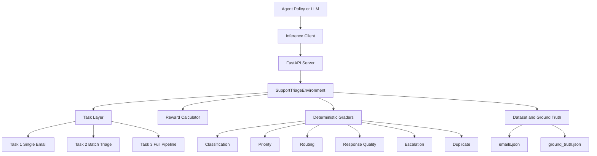

# SupportTriageEnv

SupportTriageEnv is an OpenEnv-compatible evaluation environment for training and benchmarking AI agents on customer support email triage.

The environment simulates real operational support flow:

1. Classify incoming emails
2. Set urgency priority
3. Route to the right team
4. Draft responses for important tickets
5. Handle escalations and duplicates
6. Submit episode and receive deterministic score

This repository includes the full environment engine, deterministic graders, non-sparse reward logic, Dockerized API server, baseline inference script, automated validation pipeline, and hosted deployment setup.

## Why This Project

Customer support operations depend on correct triage. Wrong routing, delayed escalation, or weak prioritization causes missed SLAs and poor customer experience. This environment provides a controlled benchmark to evaluate whether an AI agent can triage like a high-performing support operations specialist.

## Architecture



## Core Components

1. Models and schema
	- support_triage_env/models.py
	- Strong typed action, observation, state, reward, and label models via Pydantic

2. Environment engine
	- support_triage_env/server/environment.py
	- Implements reset, step, state, action validation, state transitions, reward calculation, and episode lifecycle

3. API server
	- support_triage_env/server/app.py
	- Endpoints: GET /, GET /health, POST /reset, POST /step, GET /state

4. Task layer
	- support_triage_env/tasks/task1_classify.py
	- support_triage_env/tasks/task2_batch_triage.py
	- support_triage_env/tasks/task3_full_pipeline.py

5. Graders
	- support_triage_env/graders/
	- Deterministic scoring only, no LLM dependency in grading

6. Reward design
	- support_triage_env/rewards/reward_calculator.py
	- Non-sparse step rewards plus completion adjustments and penalties

7. Data
	- support_triage_env/data/generate_dataset.py
	- support_triage_env/data/emails.json
	- support_triage_env/data/ground_truth.json

8. Validation automation
	- validate_pipeline.py
	- scripts/validate_pipeline.py

## Tasks

### Task 1: Single Email Classification

Objective:
Classify and prioritize one clear email in a short episode.

Expected behavior:
Agent should reliably identify category and urgency with minimal actions.

### Task 2: Batch Priority and Routing

Objective:
Handle a 5-email mixed inbox with class, priority, and route decisions.

Expected behavior:
Agent should avoid simple mapping errors and handle edge routing rules.

### Task 3: Full Pipeline

Objective:
Handle 8 to 10 email episodes including P1 issues, VIP handling, duplicates, escalation, and draft-response quality.

Expected behavior:
Agent should balance accuracy, coverage, and response quality under limited steps.

## Scoring and Reward Summary

1. Step-level reward is non-sparse.
2. Correct actions provide incremental reward.
3. Invalid and repeated actions are penalized.
4. VIP downgrade and incomplete triage behavior are penalized.
5. Final episode score is deterministic and bounded.

Task 3 uses weighted composite grading across:

1. Classification quality
2. Priority quality
3. Routing quality
4. Response quality
5. Escalation behavior
6. Duplicate handling

## API Contract

Base URL:

1. Local: http://127.0.0.1:8000
2. Hosted: https://mishatul-meta.hf.space

Endpoints:

1. GET /
2. GET /health
3. POST /reset
4. POST /step
5. GET /state

Example health response:

```json
{
  "status": "ok",
  "service": "support-triage-env"
}
```

## Local Setup

1. Create and activate virtual environment

```powershell
python -m venv .venv
.\.venv\Scripts\Activate.ps1
```

2. Install dependencies

```powershell
python -m pip install -r requirements.txt
```

3. Generate dataset if needed

```powershell
python -m support_triage_env.data.generate_dataset
```

4. Start API server

```powershell
python -m uvicorn support_triage_env.server.app:app --host 127.0.0.1 --port 8000
```

5. Run baseline inference

```powershell
$env:API_BASE_URL='http://127.0.0.1:8000'
python inference.py
```

## Docker Usage

Build image:

```powershell
docker build -t support-triage-env -f support_triage_env/server/Dockerfile .
```

Run container:

```powershell
docker run --rm -p 8010:8000 support-triage-env
```

Smoke test:

```powershell
Invoke-RestMethod -Uri http://127.0.0.1:8010/health -Method Get
```

## One-Command Validation

Run full quality and deployment checks:

```powershell
python validate_pipeline.py
```

This validates:

1. Test suite and coverage
2. Docker build
3. Container endpoint smoke tests
4. OpenEnv validation

## CI and Branch Protection

1. GitHub Actions workflow triggers on push and pull request
	- .github/workflows/validate-pipeline.yml
2. Main branch protection requires validate check to pass before merge

## Repository Structure

```text
support_triage_env/
  data/
  graders/
  rewards/
  server/
  tasks/
  client.py
  models.py
tests/
scripts/
validate_pipeline.py
inference.py
openenv.yaml
Dockerfile
```

## Current Validation Snapshot

1. Full validation pipeline: pass
2. Coverage: above 80 percent
3. OpenEnv validate: pass
4. Docker smoke tests: pass
5. Hosted endpoint checks: pass

## Notes

1. The detailed hackathon reference documents remain in files/ and are intentionally not modified by this README update.
2. This root README is the primary operational documentation for setup, testing, and deployment.
